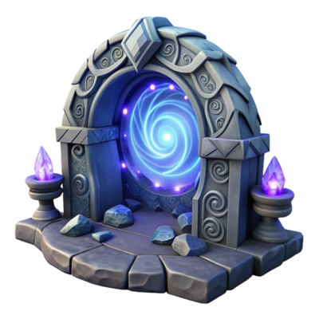

<div align="center">

<span></span>

  
### NNekoWeaponIcons
Can't seem to find the right weapon for the job?  This may help!

[](https://github.com/NNekoPlugins/NNekoWeaponIcons/releases/latest)

**[Issues](https://github.com/NNekoPlugins/NNekoWeaponIcons/issues) · [Pull Requests](https://github.com/NNekoPlugins/NNekoWeaponIcons/pulls) · [Releases](https://github.com/NNekoPlugins/NNekoWeaponIcons/releases/latest)**

</div>

---

## About 
Adds a Clas/Job Icon Overlay in Armoury Chest.  Split from VIWI plugin's Kitchen Sink module.

## Features
- Config Options:
    - Mini mode (bottom-left icons): Draws smaller icons anchored to the bottom-left of each Armoury slot.
    - Require Ctrl key: When enabled, overlay only appears while holding Ctrl.

## Installation
> **Warning**  
> No support will be provided on any Dalamud official support channel. Please use the [Issues](https://github.com/NNekoPlugins/NNekoWeaponIcons/issues) page for any support requests. Do NOT ask for support anywhere else, as support for 3rd-party plugins is not provided by the Dalamud team. 
> 
> Additionally, you should understand that this plugin could be detected by other players or a GM, use at your own risk.

This plugin can be installed as a 3rd-party plugin via the Dalamud Plugin Installer. To do so, add the following URL to `Settings > Experimental > Custom Plugin Repositories`:

```
https://raw.githubusercontent.com/NNekoPlugins/NNekoWeaponIcons/main/repo.json
```
